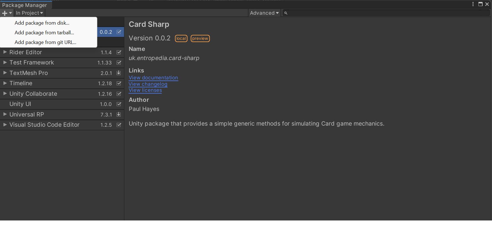
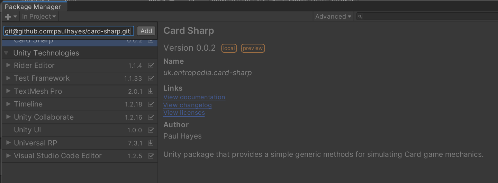

## Summary
🎴🎴🎴🎴

Simulate board game card mechanics. 

Supports
Shuffle, Cut, Deal, Insert randomly.

All operations are designed to prevent multiple references to your cards. 

♠️♥️♦️♣️

## Installation

In Unity, go to Package Manager, and manually add the package via the git url. 






## How Use

Create a base class for your card. And then you can instantiate a Deck by providing it a List of Cards. You can inherit from ScriptableObject or Monobehaviour.

```
public class Card: Monobehaviour 
{

}

```

```
public class Game: Monobehaviour
{
    Deck<Card> m_mainDeck;
    List<Deck<Card>> m_hands;

    public void Start()
    {
        //create a deck from the Cards in the scene
        m_mainDeck = new Deck<Card>(new List<Card>( GetComponents<Card>() ) );
        
        m_mainDeck.Shuffle();
        var jokers = m_mainDeck.Seperate((card)=>card.name.Contains("joker"));

        //deal 2 cards to each player.
        m_hands = m_mainDeck.Deal(4,2);
    }
}
```


